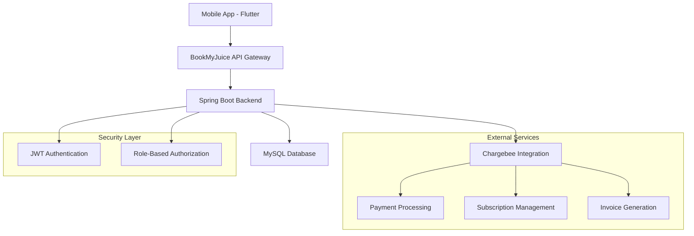
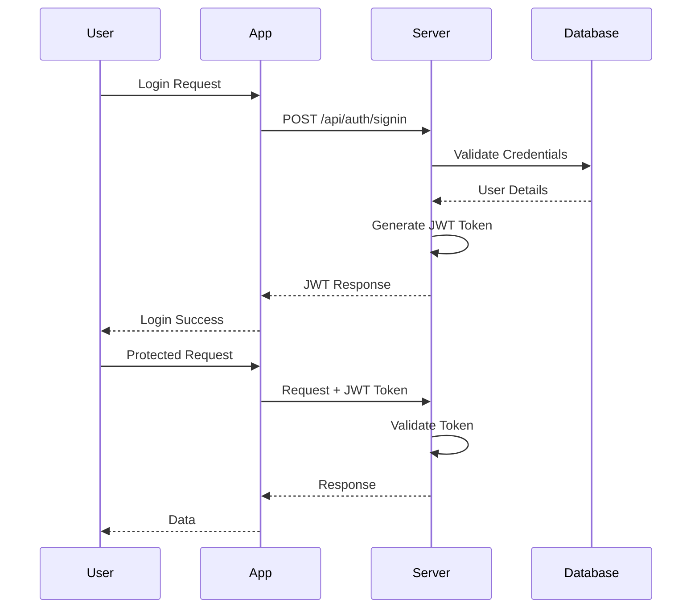
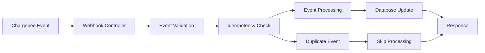
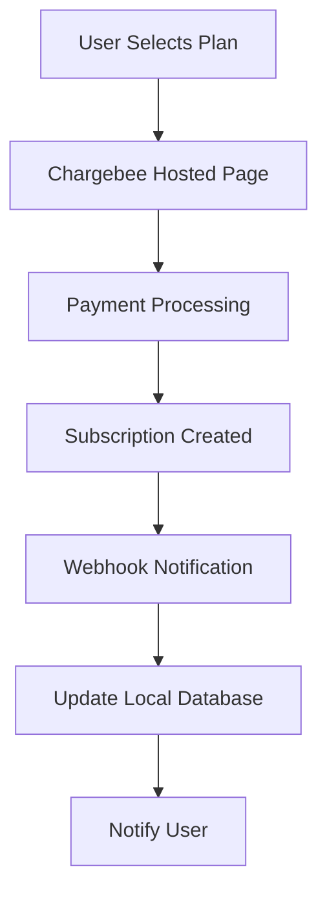

# BookMyJuice Server - Backend Documentation

## 📋 Overview

BookMyJuice Server is a **Spring Boot-based backend application** that powers the BookMyJuice cold-pressed juice subscription service. It provides secure authentication, subscription management, and seamless integration with Chargebee for billing and payment processing.

## 🏗️ Architecture

### System Architecture



### Technology Stack

| Component | Technology | Version |
|-----------|-----------|---------|
| **Framework** | Spring Boot | 3.1.0 |
| **Language** | Java | 17+ |
| **Database** | MySQL | 8.x |
| **Build Tool** | Maven | 3.6+ |
| **Authentication** | JWT | 0.11.5 |
| **Security** | Spring Security | 6.x |
| **Payment Integration** | Chargebee | 3.29.0 |
| **ORM** | Spring Data JPA | 3.1.0 |

## 🎯 Core Features

### 🔐 Authentication & Authorization
- **JWT-based Authentication** with secure token management
- **Role-based Access Control** (User, Moderator, Admin)
- **Password Encryption** using BCrypt
- **Session Management** with refresh tokens

### 💳 Subscription Management
- **Chargebee Integration** for subscription lifecycle
- **Multiple Plan Support** (Premium, Signature, Delight)
- **Subscription Status Tracking** (Active, Cancelled, Paused)
- **Billing Cycle Management**

### 🛒 Product Management
- **Item Management** for juice products
- **Pricing Strategy** with multiple price points
- **Inventory Tracking**
- **Product Catalog** with categories

### 📦 Order Processing
- **Order Lifecycle Management**
- **Payment Processing** via Chargebee
- **Invoice Generation**
- **Order Tracking** and status updates

### 🎣 Webhook Integration
- **Real-time Event Processing** from Chargebee
- **Event Deduplication** and idempotency
- **Error Handling** and retry mechanisms

## 📁 Project Structure

```
bmjServer/
├── src/
│   ├── main/
│   │   ├── java/com/bookmyjuice/
│   │   │   ├── bmjServer.java                 # Main Application Entry Point
│   │   │   ├── ChargeBeeConfig.java          # Chargebee Configuration
│   │   │   ├── WebConfig.java                # Web Configuration
│   │   │   ├── controllers/                   # REST Controllers
│   │   │   │   ├── AuthController.java       # Authentication endpoints
│   │   │   │   ├── PricingPageController.java # Pricing management
│   │   │   │   ├── SelfServePageController.java # Customer portal
│   │   │   │   ├── OneTimeCheckoutController.java # One-time purchases
│   │   │   │   ├── ChargebeeSyncController.java # Data synchronization
│   │   │   │   ├── TestController.java       # Test endpoints
│   │   │   │   ├── MetadataTestController.java # Metadata testing
│   │   │   │   └── webhooks/                 # Webhook controllers
│   │   │   │       ├── CustomerWebhookController.java
│   │   │   │       ├── SubscriptionWebhookController.java
│   │   │   │       ├── InvoiceWebhookController.java
│   │   │   │       ├── PaymentWebhookController.java
│   │   │   │       ├── TransactionWebhookController.java
│   │   │   │       ├── OrderWebhookController.java
│   │   │   │       ├── CreditNoteWebhookController.java
│   │   │   │       ├── ItemWebhookController.java
│   │   │   │       └── ItemPriceWebhookController.java
│   │   │   ├── models/                       # Data Models
│   │   │   │   ├── entities/                # JPA Entities
│   │   │   │   │   ├── CustomerEntity.java
│   │   │   │   │   ├── SubscriptionEntity.java
│   │   │   │   │   ├── ItemEntity.java
│   │   │   │   │   ├── ItemPriceEntity.java
│   │   │   │   │   ├── OrderEntity.java
│   │   │   │   │   ├── InvoiceEntity.java
│   │   │   │   │   ├── PaymentEntity.java
│   │   │   │   │   ├── PlanEntity.java
│   │   │   │   │   ├── AddonEntity.java
│   │   │   │   │   ├── ChargeEntity.java
│   │   │   │   │   ├── CreditNoteEntity.java
│   │   │   │   │   ├── AttachedItemEntity.java
│   │   │   │   │   ├── SubscriptionItemEntity.java
│   │   │   │   │   ├── BillingAddressEntity.java
│   │   │   │   │   └── ShippingAddressEntity.java
│   │   │   │   ├── mappers/                 # Entity-DTO Mappers
│   │   │   │   ├── User.java               # User entity
│   │   │   │   ├── Role.java               # Role entity
│   │   │   │   ├── ERole.java              # Role enumeration
│   │   │   │   ├── EventType.java          # Event type enumeration
│   │   │   │   └── PaymentMethod.java      # Payment method enumeration
│   │   │   ├── payload/                    # Request/Response DTOs
│   │   │   │   ├── request/
│   │   │   │   │   ├── LoginRequest.java
│   │   │   │   │   └── SignupRequest.java
│   │   │   │   └── response/
│   │   │   │       ├── JwtResponse.java
│   │   │   │       └── MessageResponse.java
│   │   │   ├── repository/                 # Data Access Layer
│   │   │   │   ├── CustomerRepository.java
│   │   │   │   ├── SubscriptionRepository.java
│   │   │   │   ├── ItemRepository.java
│   │   │   │   ├── ItemPriceRepository.java
│   │   │   │   ├── OrderRepository.java
│   │   │   │   ├── InvoiceRepository.java
│   │   │   │   ├── PaymentRepository.java
│   │   │   │   ├── PlanRepository.java
│   │   │   │   ├── AddonRepository.java
│   │   │   │   ├── ChargeRepository.java
│   │   │   │   ├── CreditNoteRepository.java
│   │   │   │   ├── AttachedItemRepository.java
│   │   │   │   ├── SubscriptionItemRepository.java
│   │   │   │   ├── UserRepository.java
│   │   │   │   └── RoleRepository.java
│   │   │   ├── security/                   # Security Configuration
│   │   │   │   ├── WebSecurityConfig.java
│   │   │   │   └── jwt/
│   │   │   │       ├── JwtUtils.java
│   │   │   │       ├── JwtAuthEntryPoint.java
│   │   │   │       └── AuthTokenFilter.java
│   │   │   ├── services/                   # Business Logic Layer
│   │   │   │   ├── CustomerService.java
│   │   │   │   ├── SubscriptionService.java
│   │   │   │   ├── ItemService.java
│   │   │   │   ├── ItemPriceService.java
│   │   │   │   ├── OrderService.java
│   │   │   │   ├── InvoiceService.java
│   │   │   │   ├── PaymentService.java
│   │   │   │   ├── PlanService.java
│   │   │   │   ├── AddonService.java
│   │   │   │   ├── ChargeService.java
│   │   │   │   ├── CreditNoteService.java
│   │   │   │   ├── AttachedItemService.java
│   │   │   │   ├── ChargebeeSyncService.java
│   │   │   │   ├── IdempotencyService.java
│   │   │   │   ├── WebhookEventProcessor.java
│   │   │   │   ├── MetadataTestService.java
│   │   │   │   ├── UserDetailsImpl.java
│   │   │   │   └── UserDetailsServiceImpl.java
│   │   │   └── config/                     # Configuration Classes
│   │   │       └── ChargebeeSyncConfig.java
│   │   └── resources/
│   │       ├── application.properties      # Application Configuration
│   │       └── db/                        # Database Scripts
│   └── test/
│       └── java/com/bookmyjuice/         # Test Cases
├── pom.xml                               # Maven Dependencies
└── README.md                            # This Documentation
```

## 🔧 Configuration

### Environment Variables

```properties
# Database Configuration
DB_USERNAME=your_mysql_username
DB_PASSWORD=your_mysql_password

# Admin Configuration
ADMIN_USER=admin_username
ADMIN_PASSWORD=admin_password

# JWT Configuration
JWT_SECRET=your_jwt_secret_key

# Chargebee Configuration
CHARGEBEE_SITE=your_chargebee_site
CHARGEBEE_API_KEY=your_chargebee_api_key
```

### Application Properties

```properties
# Database Configuration
spring.datasource.url=jdbc:mysql://localhost:3306/bmj_db?allowPublicKeyRetrieval=true&useSSL=false
spring.datasource.username=${DB_USERNAME}
spring.datasource.password=${DB_PASSWORD}

# JPA/Hibernate Configuration
spring.jpa.properties.hibernate.dialect=org.hibernate.dialect.MySQLDialect
spring.jpa.hibernate.ddl-auto=update
spring.jpa.show-sql=true

# Server Configuration
server.port=8080
server.address=localhost

# Security Configuration
spring.security.user.name=${ADMIN_USER}
spring.security.user.password=${ADMIN_PASSWORD}

# Chargebee Configuration
chargebee.site=${CHARGEBEE_SITE}
chargebee.apiKey=${CHARGEBEE_API_KEY}

# JWT Configuration
bezkoder.app.jwtSecret=${JWT_SECRET}
bezkoder.app.jwtExpirationMs=86400000
```

## 🚀 API Documentation

### Base URL
```
Production: https://api.bookmyjuice.co.in:8080
Development: http://localhost:8080
```

### Authentication
All protected endpoints require JWT token in the Authorization header:
```
Authorization: Bearer <jwt_token>
```

---

## 🔐 Authentication Endpoints

### 1. User Login
**Endpoint:** `POST /api/auth/signin`  
**Description:** Authenticate user and receive JWT token  
**Access:** Public

**Request Body:**
```json
{
  "username": "9876543210",
  "password": "SecurePass123!"
}
```

**Success Response (200):**
```json
{
  "accessToken": "eyJhbGciOiJIUzI1NiIsInR5cCI6IkpXVCJ9...",
  "tokenType": "Bearer",
  "id": 1,
  "username": "9876543210",
  "email": "user@example.com",
  "roles": ["ROLE_USER"]
}
```

**Error Response (401):**
```json
{
  "message": "Error: Invalid credentials!"
}
```

### 2. User Registration
**Endpoint:** `POST /api/auth/signup`  
**Description:** Register new user account  
**Access:** Public

**Request Body:**
```json
{
  "username": "9876543210",
  "email": "user@example.com",
  "password": "SecurePass123!",
  "firstName": "John",
  "lastName": "Doe",
  "address": "123 Main Street",
  "extendedAddr": "Apartment 4B",
  "extendedAddr2": "Near Central Park",
  "city": "Mumbai",
  "state": "Maharashtra",
  "country": "IN",
  "zip": "400001",
  "role": ["user"]
}
```

**Success Response (200):**
```json
{
  "message": "12345"
}
```

**Error Response (400):**
```json
{
  "message": "Error: Username is already taken!"
}
```

### 3. Auto Login
**Endpoint:** `GET /api/auth/autologin`  
**Description:** Validate JWT token for auto-login  
**Access:** Protected  
**Headers:** `Authorization: Bearer <token>`

**Success Response (200):**
```json
{
  "message": "ok"
}
```

**Error Response (400):**
```json
{
  "message": "Error: Invalid JWT token!"
}
```

### 4. Password Reset
**Endpoint:** `POST /api/auth/resetpassword`  
**Description:** Reset user password  
**Access:** Public

**Request Body:**
```json
{
  "username": "9876543210",
  "password": "NewSecurePass123!"
}
```

**Success Response (200):**
```json
{
  "message": "ok"
}
```

**Error Response (400):**
```json
{
  "message": "Error: password must contain at least one uppercase letter!"
}
```

---

## 🛒 Product & Menu Endpoints

### 1. Get Charge Items (One-time Products)
**Endpoint:** `GET /api/test/charge-items`  
**Description:** Get all available juice items for one-time purchase  
**Access:** Public

**Success Response (200):**
```json
[
  {
    "id": "pineapple300",
    "name": "Pineapple Juice 300ml",
    "description": "Fresh cold-pressed pineapple juice",
    "type": "CHARGE",
    "status": "ACTIVE",
    "unit": "ml",
    "itemFamilyId": "juices",
    "enabledInPortal": true,
    "enabledForCheckout": true,
    "metadata": {
      "color": "#FFD700",
      "image_url": "https://example.com/pineapple.jpg",
      "nutritional_info": "Rich in Vitamin C"
    },
    "itemPrices": [
      {
        "id": "pineapple300-INR",
        "name": "Pineapple 300ml - INR",
        "currencyCode": "INR",
        "price": 150.00,
        "period": null,
        "periodUnit": null,
        "status": "ACTIVE"
      }
    ]
  }
]
```

### 2. Get All Chargebee Items
**Endpoint:** `GET /api/test/chargebeeItems`  
**Description:** Get all items from Chargebee (Plans, Charges, Addons)  
**Access:** Protected (USER, MODERATOR, ADMIN)  
**Headers:** `Authorization: Bearer <token>`

**Success Response (200):**
```json
[
  {
    "id": "premium-plan",
    "name": "Premium Juice Plan",
    "description": "Daily fresh juice delivery",
    "type": "PLAN",
    "status": "ACTIVE",
    "itemPrices": [
      {
        "id": "premium-plan-monthly",
        "price": 2999.00,
        "period": 1,
        "periodUnit": "MONTH",
        "currencyCode": "INR"
      }
    ]
  }
]
```

### 3. Get Database Items
**Endpoint:** `GET /api/test/databaseItems`  
**Description:** Get all items stored in local database  
**Access:** Protected (USER, MODERATOR, ADMIN)  
**Headers:** `Authorization: Bearer <token>`

**Success Response (200):**
```json
[
  {
    "id": "orange300",
    "name": "Orange Juice 300ml",
    "type": "CHARGE",
    "status": "ACTIVE",
    "metadata": "{\"color\":\"#FFA500\",\"vitamins\":\"C,A\"}"
  }
]
```

---

## 💳 Subscription & Pricing Endpoints

### 1. Generate Pricing Page Session URLs
**Endpoint:** `GET /api/test/generate_pricing_page_session_url`  
**Description:** Get pricing page URLs for all subscription plans  
**Access:** Protected (USER, MODERATOR, ADMIN)  
**Headers:** `Authorization: Bearer <token>`

**Success Response (200):**
```json
{
  "premium": {
    "id": "session_abc123",
    "url": "https://bookmyjuice-test.chargebee.com/pages/v3/session_abc123",
    "state": "created",
    "embed": false,
    "created_at": 1640995200,
    "expires_at": 1641081600
  },
  "signature": {
    "id": "session_def456",
    "url": "https://bookmyjuice-test.chargebee.com/pages/v3/session_def456",
    "state": "created",
    "embed": false,
    "created_at": 1640995200,
    "expires_at": 1641081600
  },
  "delight": {
    "id": "session_ghi789",
    "url": "https://bookmyjuice-test.chargebee.com/pages/v3/session_ghi789",
    "state": "created",
    "embed": false,
    "created_at": 1640995200,
    "expires_at": 1641081600
  }
}
```

---

## 🛍️ Checkout & Payment Endpoints

### 1. One-Time Checkout Page
**Endpoint:** `GET /api/test/oneTimeCheckoutPageUrl`  
**Description:** Generate checkout page for one-time purchases  
**Access:** Protected (USER, MODERATOR, ADMIN)  
**Headers:** `Authorization: Bearer <token>`

**Success Response (200):**
```json
{
  "id": "hostedpage_abc123",
  "type": "checkout_one_time_for_items",
  "url": "https://bookmyjuice-test.chargebee.com/pages/v3/hostedpage_abc123",
  "state": "created",
  "embed": false,
  "created_at": 1640995200,
  "expires_at": 1641081600,
  "content": {
    "customer": {
      "id": "12345",
      "email": "user@example.com"
    },
    "items": [
      {
        "item_price_id": "ABC-INR",
        "quantity": 1
      }
    ]
  }
}
```

### 2. Cart Checkout
**Endpoint:** `GET /api/test/cartCheckout`  
**Description:** Generate checkout page for cart items  
**Access:** Protected (USER, MODERATOR, ADMIN)  
**Headers:** `Authorization: Bearer <token>`

**Success Response (200):**
```json
{
  "id": "hostedpage_cart123",
  "type": "checkout_one_time_for_items",
  "url": "https://bookmyjuice-test.chargebee.com/pages/v3/hostedpage_cart123",
  "state": "created",
  "embed": false,
  "created_at": 1640995200,
  "expires_at": 1641081600
}
```

---

## 👤 User Management Endpoints

### 1. Get User Profile
**Endpoint:** `GET /api/test/user`  
**Description:** Get current user profile information  
**Access:** Protected (USER, MODERATOR, ADMIN)  
**Headers:** `Authorization: Bearer <token>`

**Success Response (200):**
```json
{
  "id": 1,
  "username": "9876543210",
  "email": "user@example.com",
  "firstName": "John",
  "lastName": "Doe",
  "address": "123 Main Street",
  "extendedAddr": "Apartment 4B",
  "city": "Mumbai",
  "state": "Maharashtra",
  "country": "IN",
  "zip": "400001",
  "roles": [
    {
      "id": 1,
      "name": "ROLE_USER"
    }
  ]
}
```

### 2. Self-Serve Portal
**Endpoint:** `GET /api/test/portal`  
**Description:** Generate Chargebee self-serve portal session  
**Access:** Protected (USER, MODERATOR, ADMIN)  
**Headers:** `Authorization: Bearer <token>`

**Success Response (200):**
```json
{
  "id": "portal_session_abc123",
  "token": "portal_token_xyz789",
  "access_url": "https://bookmyjuice-test.chargebee.com/portal/v2/portal_session_abc123",
  "redirect_url": "https://app.bookmyjuice.com/dashboard",
  "status": "created",
  "created_at": 1640995200,
  "expires_at": 1641081600,
  "customer_id": "12345"
}
```

---

## 🔄 Admin & Sync Endpoints

### 1. Chargebee Sync Status
**Endpoint:** `GET /api/admin/chargebee-sync/status`  
**Description:** Get current synchronization status  
**Access:** Protected (ADMIN only)  
**Headers:** `Authorization: Bearer <token>`

**Success Response (200):**
```json
{
  "status": "completed",
  "lastSyncTime": "2024-01-15T10:30:00Z",
  "itemsSynced": 150,
  "customersSynced": 1200,
  "subscriptionsSynced": 450,
  "errors": 0
}
```

### 2. Trigger Manual Sync
**Endpoint:** `POST /api/admin/chargebee-sync/sync`  
**Description:** Trigger manual synchronization with Chargebee  
**Access:** Protected (ADMIN only)  
**Headers:** `Authorization: Bearer <token>`

**Success Response (200):**
```json
{
  "message": "Manual sync started. Check logs for progress."
}
```

### 3. Sync Health Check
**Endpoint:** `GET /api/admin/chargebee-sync/health`  
**Description:** Health check for sync service  
**Access:** Protected (ADMIN only)  
**Headers:** `Authorization: Bearer <token>`

**Success Response (200):**
```json
{
  "message": "Chargebee Sync Service is running"
}
```

---

## 🎣 Webhook Endpoints

All webhook endpoints accept POST requests from Chargebee and process events automatically.

### Webhook Event Structure
```json
{
  "id": "ev_abc123",
  "occurred_at": 1640995200,
  "source": "admin_console",
  "user": "admin@bookmyjuice.com",
  "object": "event",
  "api_version": "v2",
  "content": {
    "customer": {
      "id": "12345",
      "first_name": "John",
      "last_name": "Doe",
      "email": "john@example.com"
    }
  },
  "event_type": "customer_created"
}
```

### Supported Webhook Events

| Endpoint | Event Types | Description |
|----------|-------------|-------------|
| `POST /api/webhooks/customers` | customer_created, customer_changed, customer_deleted | Customer lifecycle events |
| `POST /api/webhooks/subscriptions` | subscription_created, subscription_changed, subscription_cancelled | Subscription lifecycle events |
| `POST /api/webhooks/invoices` | invoice_generated, invoice_updated, invoice_paid | Invoice events |
| `POST /api/webhooks/payments` | payment_succeeded, payment_failed, payment_refunded | Payment events |
| `POST /api/webhooks/orders` | order_created, order_updated, order_delivered | Order lifecycle events |
| `POST /api/webhooks/items` | item_created, item_updated, item_deleted | Product catalog events |
| `POST /api/webhooks/item-prices` | item_price_created, item_price_updated, item_price_deleted | Pricing events |

---

## 🌐 Webhook Hosting (Dev/Test)

Chargebee webhooks originate from Chargebee’s cloud and cannot reach a localhost server. To receive webhooks during development or testing, expose the backend on a public HTTPS URL.

- Public requirement: Use a publicly reachable HTTPS endpoint (production/staging) or a secure tunnel (e.g., ngrok or Cloudflare Tunnel) to your dev machine.
- Configure endpoints: Point Chargebee webhooks to your public URL paths under `/api/webhooks/**` (for example, `https://your-public-host/api/webhooks/subscriptions`).
- Authentication: Webhook routes are protected with HTTP Basic Auth. Set credentials to match your environment variables (`WEBHOOK_USERNAME`, `WEBHOOK_PASSWORD`) in Chargebee’s webhook settings.
- Test site: All hosted pages and portal/session URLs in test mode use `https://bookmyjuice-test.chargebee.com`.

Example dev setup with ngrok:

```bash
# Expose local 8080 over HTTPS
ngrok http 8080

# Then configure Chargebee webhook URL using the given HTTPS forwarding URL
# e.g. https://<random>.ngrok.io/api/webhooks/subscriptions
```

Note: Keep your tunnel running while testing; if the URL changes, update it in Chargebee.

## 🧪 Test Endpoints

### 1. Public Access Test
**Endpoint:** `GET /api/test/all`  
**Description:** Test endpoint for public access  
**Access:** Public

**Success Response (200):**
```
Public Content.
```

### 2. Moderator Access Test
**Endpoint:** `GET /api/test/mod`  
**Description:** Test endpoint for moderator access  
**Access:** Protected (MODERATOR)  
**Headers:** `Authorization: Bearer <token>`

**Success Response (200):**
```
Moderator Board.
```

### 3. Admin Access Test
**Endpoint:** `GET /api/test/admin`  
**Description:** Test endpoint for admin access  
**Access:** Protected (ADMIN)  
**Headers:** `Authorization: Bearer <token>`

**Success Response (200):**
```
Admin Board.
```

---

## 📝 Request/Response Models

### LoginRequest
```json
{
  "username": "string (required, phone number)",
  "password": "string (required)"
}
```

### SignupRequest
```json
{
  "username": "string (required, 3-10 digits)",
  "email": "string (required, valid email)",
  "password": "string (required, 6-40 chars)",
  "firstName": "string (max 25 chars)",
  "lastName": "string (max 25 chars)",
  "address": "string (max 120 chars)",
  "extendedAddr": "string (max 120 chars)",
  "extendedAddr2": "string (max 120 chars)",
  "city": "string (max 120 chars)",
  "state": "string (max 120 chars)",
  "country": "string (2 chars, e.g., 'IN')",
  "zip": "string (max 6 chars)",
  "role": ["string array, optional"]
}
```

### JwtResponse
```json
{
  "accessToken": "string (JWT token)",
  "tokenType": "Bearer",
  "id": "number (user ID)",
  "username": "string",
  "email": "string",
  "roles": ["string array"]
}
```

### MessageResponse
```json
{
  "message": "string"
}
```

---

## ⚠️ Error Handling

### Common Error Responses

**400 Bad Request:**
```json
{
  "message": "Error: Invalid request data"
}
```

**401 Unauthorized:**
```json
{
  "message": "Error: Invalid JWT token!"
}
```

**403 Forbidden:**
```json
{
  "message": "Error: Access denied"
}
```

**500 Internal Server Error:**
```json
{
  "message": "Error: Internal server error"
}
```

---

## 🔒 Security Notes

1. **JWT Token Expiry:** Tokens expire after 24 hours (86400000 ms)
2. **Password Requirements:** 
   - 8-20 characters
   - At least one lowercase letter
   - At least one uppercase letter
   - At least one number
   - At least one special character
   - No spaces or control characters
3. **Rate Limiting:** Implement rate limiting for authentication endpoints
4. **HTTPS Only:** All production endpoints must use HTTPS
5. **Input Validation:** All inputs are validated server-side

## 🔒 Security Features

### Authentication Flow



### Role-Based Access Control

| Role | Permissions |
|------|-------------|
| **USER** | Basic access to user-specific data |
| **MODERATOR** | Moderate user content and basic admin tasks |
| **ADMIN** | Full system access and administrative privileges |

## 📊 Data Models

### Core Entities

#### Customer Entity
```java
@Entity
public class CustomerEntity {
    @Id
    private String id;
    private String firstName;
    private String lastName;
    private String email;
    private String phone;
    private String company;
    private String vatNumber;
    private boolean autoCollection;
    private boolean deleted;
    // ... billing and shipping addresses
}
```

#### Subscription Entity
```java
@Entity
public class SubscriptionEntity {
    @Id
    private String id;
    private String customerId;
    private String planId;
    private String status;
    private Long currentTermStart;
    private Long currentTermEnd;
    private Long nextBillingAt;
    private Integer billingPeriod;
    private String billingPeriodUnit;
    // ... subscription details
}
```

#### Item Entity
```java
@Entity
public class ItemEntity {
    @Id
    private String id;
    private String name;
    private String description;
    private String type;
    private String status;
    private String unit;
    private boolean enabledInPortal;
    private boolean enabledForCheckout;
    
    @OneToMany(mappedBy = "item", cascade = CascadeType.ALL)
    private List<ItemPriceEntity> itemPrices;
}
```

## 🎣 Webhook Processing

### Event Processing Flow



### Supported Events

#### Subscription Events
- `subscription_created`
- `subscription_changed`
- `subscription_cancelled`
- `subscription_reactivated`
- `subscription_renewed`

#### Customer Events
- `customer_created`
- `customer_changed`
- `customer_deleted`

#### Payment Events
- `payment_succeeded`
- `payment_failed`
- `payment_refunded`

#### Invoice Events
- `invoice_generated`
- `invoice_updated`
- `invoice_paid`

## 🔄 Chargebee Integration

### Subscription Management



### Key Integration Points

1. **Hosted Pages** - For subscription signup and management
2. **Customer Portal** - For self-service account management
3. **Webhooks** - Real-time event synchronization
4. **API Calls** - Direct integration for custom workflows

## 🚀 Getting Started

### Prerequisites

- Java 17+
- Maven 3.6+
- MySQL 8.x (or compatible)
- [Chargebee account](https://www.chargebee.com/)

### Database Setup

```sql
CREATE DATABASE bmj_db;
INSERT INTO roles(name) VALUES('ROLE_USER');
INSERT INTO roles(name) VALUES('ROLE_MODERATOR');
INSERT INTO roles(name) VALUES('ROLE_ADMIN');
```

### Build & Run

```powershell
mvn clean install
mvn spring-boot:run
```

## 🚀 Production Deployment Guide

### Pre-Deployment Checklist

- [ ] Database credentials configured in environment variables
- [ ] JWT secret key generated and stored securely
- [ ] Webhook credentials (WEBHOOK_USERNAME, WEBHOOK_PASSWORD) set in `.env`
- [ ] SSL/TLS certificates obtained and configured
- [ ] Chargebee API key configured
- [ ] Rate limiting parameters tuned for your expected traffic
- [ ] Log file directories created and permissions set
- [ ] Database migrations verified on staging environment

### Environment Variables

Set the following environment variables before starting the application:

```bash
# Database Configuration
DB_HOST=your-database-host
DB_PORT=3306
DB_NAME=bmj_db
DB_USERNAME=db_user
DB_PASSWORD=secure_password

# Admin User
ADMIN_USER=support@bookmyjuice.co.in
ADMIN_PASSWORD=secure_admin_password

# JWT Configuration
JWT_SECRET=your_very_long_secret_key_min_32_chars

# Webhook Authentication
WEBHOOK_USERNAME=support@bookmyjuice.co.in
WEBHOOK_PASSWORD=rADHASOAMI@0

# Chargebee Configuration
CHARGEBEE_API_KEY=your_chargebee_api_key
CHARGEBEE_SITE=bookmyjuice-test  # or bookmyjuice for production
```

### Deployment Profiles

The application supports environment-specific profiles via Spring Boot profiles:

#### Development Environment
```bash
java -jar app.jar --spring.profiles.active=dev
```

**Features:**
- Debug logging enabled (DEBUG level)
- Console output for easy debugging
- Local MySQL database (localhost:3306)
- H2 console disabled
- Hot reload enabled for development
- Detailed error messages in responses

#### Production Environment
```bash
java -jar app.jar --spring.profiles.active=prod
```

**Features:**
- Warn-level logging for production
- File-based logging only (no console output)
- Remote database configuration via environment variables
- SSL/TLS required (useSSL=true)
- Validate-only Hibernate (no DDL generation)
- Error details hidden from responses
- Connection pool tuned (20 max connections)
- Batch insert/update optimizations enabled

### Building for Deployment

```bash
# Clean build with all tests
./mvnw clean verify

# Build without tests (faster)
./mvnw clean package -DskipTests

# Build with integration tests
./mvnw clean verify -Pintegration-tests
```

### Log File Configuration

Logs are configured in `src/main/resources/logback-spring.xml` with profile-specific behavior:

**Log Files (Production):**
- `logs/application.log` - General application logs
- `logs/auth.log` - Authentication and security events
- `logs/chargebee.log` - Chargebee integration logs
- `logs/webhook.log` - Webhook processing logs
- `logs/error.log` - Error-level logs only
- `logs/archive/` - Archived logs (30-day retention, 10GB total cap)

**Log Rotation:**
- Size-based: 100MB per file
- Time-based: Daily rotation
- Archive retention: 30 days
- Total log volume cap: 10GB

### Security Configuration

#### Rate Limiting

Authentication endpoints are protected with per-IP rate limiting:
- **Limit**: 10 authentication attempts per 5 minutes per IP address
- **Global Limit**: 100 requests per minute across all IPs
- **Implementation**: Bucket4j token bucket algorithm
- **Protected Endpoints**:
  - `/api/auth/signin`
  - `/api/auth/signup`

**Response Headers:**
- `X-RateLimit-Remaining` - Remaining requests
- `X-RateLimit-Limit` - Total limit (10)
- `X-RateLimit-Reset` - Reset time in seconds (300)

When rate limit is exceeded: HTTP 429 (Too Many Requests)

#### Dual Security Filter Chains

1. **JWT Filter Chain** (Default)
   - Protects most API endpoints
   - Requires valid JWT token in Authorization header
   - Supports role-based authorization (ROLE_USER, ROLE_ADMIN)

2. **Basic Auth Filter Chain** (@Order(1))
   - Protects webhook endpoints (`/api/webhooks/**`)
   - Requires HTTP Basic Authentication
   - Uses webhook credentials (WEBHOOK_USERNAME, WEBHOOK_PASSWORD)
   - Role: ROLE_WEBHOOK

3. **Public Endpoints**
   - `/api/auth/**` - Authentication endpoints
   - `/api/test/**` - Test endpoints (should be disabled in production)
   - `/actuator/health` - Health check endpoint
   - `/actuator/info` - Application info endpoint

#### CORS Configuration

CORS is enabled for all origins with the following methods:
- GET, POST, PUT, DELETE, OPTIONS
- All headers allowed
- Credentials supported

**⚠️ Production Note**: Review and restrict CORS origins for production deployment.

### Monitoring and Health Checks

**Health Endpoint**
```bash
curl http://localhost:8080/actuator/health
```

Response includes:
- Database connectivity status
- Application status
- Chargebee sync status

**Info Endpoint**
```bash
curl http://localhost:8080/actuator/info
```

Response includes:
- Application version
- Build timestamp
- Active profiles

### Chargebee Configuration

**API Integration:**
- Runs on application startup (ChargebeeSync scheduled task)
- Syncs last 24 hours of data
- Caches results in memory
- Provides inventory status via `/api/pricing` endpoint

**Webhook Handling:**
- All webhook events require HTTP Basic Authentication
- Webhook endpoints: `/api/webhooks/chargebee`
- Validates webhook origin via API key
- Stores events in database for audit trail

### Database Migration

The application uses Spring Data JPA with Hibernate for database management:

**Development Mode** (`application-dev.properties`):
```
spring.jpa.hibernate.ddl-auto=update
```

**Production Mode** (`application-prod.properties`):
```
spring.jpa.hibernate.ddl-auto=validate
```

Always run migrations on a backup before applying to production.

### Performance Tuning (Production)

**Connection Pooling (HikariCP):**
- Maximum connections: 20
- Minimum idle: 5
- Connection timeout: 30 seconds
- Idle timeout: 10 minutes
- Max lifetime: 30 minutes

**Database Batch Processing:**
- Batch insert size: 20
- Batch update size: 20
- Order inserts/updates: enabled

**Response Compression:**
- Enabled for responses > 1KB
- Excluded: image/png, image/jpeg, image/gif, application/json

### Troubleshooting Deployment

**Common Issues:**

1. **Database Connection Failed**
   - Verify DB_HOST, DB_PORT, DB_NAME environment variables
   - Check database server is running and accessible
   - Verify DB_USERNAME and DB_PASSWORD credentials

2. **JWT Token Errors**
   - Ensure JWT_SECRET is set and consistent across deployments
   - Check token expiration time (24 hours)
   - Verify Authorization header format: `Bearer <token>`

3. **Chargebee Integration Errors**
   - Verify CHARGEBEE_API_KEY is correct
   - Check CHARGEBEE_SITE setting (test vs production)
   - Review Chargebee integration logs: `logs/chargebee.log`

4. **Rate Limiting Issues**
   - Check X-RateLimit headers in response
   - Verify client IP is correctly identified
   - For development, call RateLimiterService.clearAllLimits() via admin endpoint

5. **SSL/TLS Errors**
   - Verify certificates are in Java keystore
   - Check useSSL=true in spring.datasource.url
   - Review SSL configuration in server properties

### Post-Deployment Verification

1. **Health Check**
   ```bash
   curl -X GET http://localhost:8080/actuator/health
   ```

2. **Authentication Test**
   ```powershell
   $credentials = @{
       email = "support@bookmyjuice.co.in"
       password = "password"
   }
   Invoke-RestMethod -Uri "http://localhost:8080/api/auth/signin" -Method Post -Body ($credentials | ConvertTo-Json) -ContentType "application/json"
   ```

3. **Rate Limiting Test**
   ```bash
   # Make 11 requests to trigger rate limit
   for i in {1..11}; do curl -X POST http://localhost:8080/api/auth/signin; done
   # Should return 429 on 11th request
   ```

4. **Log File Verification**
   - Check `logs/application.log` for startup messages
   - Verify no ERROR entries in `logs/error.log`
   - Confirm Chargebee sync in `logs/chargebee.log`

## 📝 Version History

| Version | Date | Changes |
|---------|------|---------|
| 0.0.2 | 2024-01-15 | Enhanced Chargebee integration, webhook processing, production profiles, rate limiting |

*This documentation is maintained by the BookMyJuice development team.*
