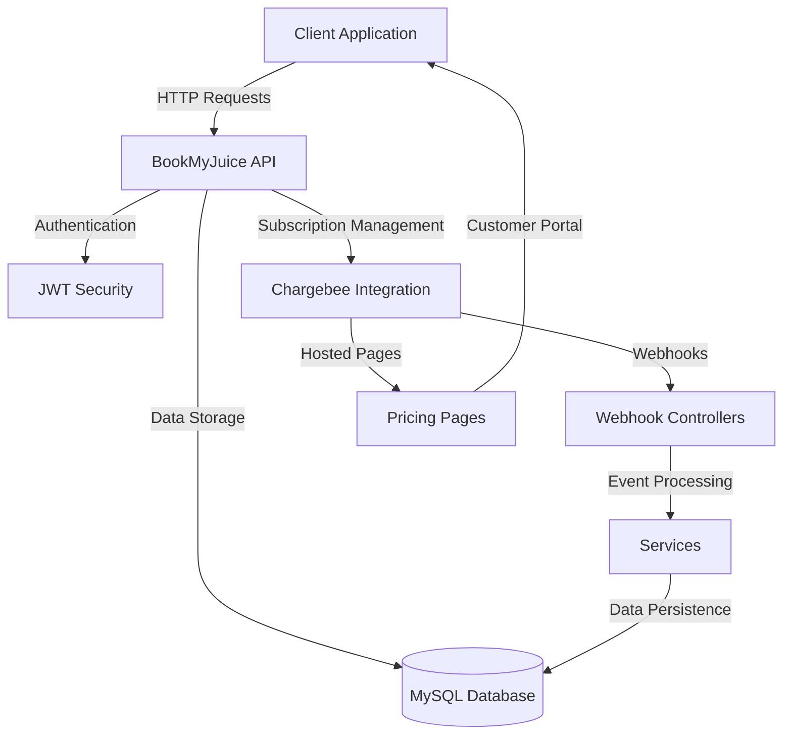

# BookMyJuice Server

A Spring Boot backend for BookMyJuice, providing secure user authentication, subscription management, and integration with Chargebee for billing and product management.

---

## Features

- **JWT Authentication** with Spring Security
- **User Registration & Login** (with roles: User, Moderator, Admin)
- **Role-based Authorization**
- **Subscription Management** (via Chargebee)
- **Pricing Page Integration** (Chargebee hosted pages)
- **RESTful API** for customer, item, and subscription management
- **MySQL Database** with Spring Data JPA
- **Password Reset** and validation
- **Extensible Controllers** for custom business logic
- **Chargebee Integration**:
  - Subscription lifecycle management
  - Payment processing and invoicing
  - Customer management
  - Product/Plan configuration
  - Order management
  - Credit notes handling
  - Transaction processing
  - Webhook handling for real-time updates

---

## Project Structure

```
src/
  main/
    java/
      com.bookmyjuice/
        bmjServer.java               # Main Spring Boot entry point
        ChargeBeeConfig.java         # Chargebee configuration
        controllers/                 # REST controllers (Auth, Webhook, Pricing, etc.)
        models/
          entities/                 # JPA entities
          mappers/                  # Entity-DTO mappers
        payload/                    # Request/response DTOs
        repository/                 # Spring Data JPA repositories
        security/                   # JWT, security config
        services/                   # Business logic and integration
    resources/
      application.properties        # Main configuration
test/
  java/
    (empty - add your tests here)
```

---

## Getting Started

### Prerequisites

- Java 17+
- Maven 3.6+
- MySQL 8.x (or compatible)
- [Chargebee account](https://www.chargebee.com/)

### Configuration

Edit `src/main/resources/application.properties`:

```properties
# Database
spring.datasource.url=jdbc:mysql://localhost:3306/bmj_db?allowPublicKeyRetrieval=true&useSSL=false
spring.datasource.username=${DB_USERNAME}
spring.datasource.password=${DB_PASSWORD}

# JPA/Hibernate
spring.jpa.properties.hibernate.dialect=org.hibernate.dialect.MySQLDialect
spring.jpa.hibernate.ddl-auto=update

# Server
server.port=8080
server.address=localhost

# Security
spring.security.user.name=${ADMIN_USER}
spring.security.user.password=${ADMIN_PASSWORD}

# Chargebee
chargebee.site=your-site-name
chargebee.apiKey=your-api-key

# JWT
bezkoder.app.jwtSecret=${JWT_SECRET}
bezkoder.app.jwtExpirationMs=86400000
```

### Environment Variables

Set the following environment variables:
- `DB_USERNAME`: MySQL database username
- `DB_PASSWORD`: MySQL database password
- `ADMIN_USER`: Admin username
- `ADMIN_PASSWORD`: Admin password
- `JWT_SECRET`: JWT signing key

### Database Setup

```sql
CREATE DATABASE bmj_db;
INSERT INTO roles(name) VALUES('ROLE_USER');
INSERT INTO roles(name) VALUES('ROLE_MODERATOR');
INSERT INTO roles(name) VALUES('ROLE_ADMIN');
```

### Build & Run

```powershell
mvn clean install
mvn spring-boot:run
```

---

## API Endpoints

### Authentication
- `POST /api/auth/signin` - User login
- `POST /api/auth/signup` - User registration

### Webhooks
- `POST /api/webhooks/subscriptions` - Handle subscription events
- `POST /api/webhooks/customers` - Handle customer events
- `POST /api/webhooks/invoices` - Handle invoice events
- `POST /api/webhooks/payments` - Handle payment events
- `POST /api/webhooks/transactions` - Handle transaction events
- `POST /api/webhooks/orders` - Handle order events
- `POST /api/webhooks/credit-notes` - Handle credit note events

### Pricing & Payments
- `GET /api/pricing-page` - Get pricing page details
- `POST /api/self-serve-page` - Create self-serve portal session
- `POST /api/one-time-page` - Create one-time payment page

---

## Chargebee Integration

### Events Handled
- Subscription lifecycle (create, update, cancel, reactivate)
- Customer management
- Payment processing
- Invoice generation
- Order management
- Credit note handling
- Transaction processing

### Webhook Security
- Event signature validation
- Idempotency handling
- Error logging and monitoring

---

## Security

- JWT-based authentication
- Password encryption (BCrypt)
- Role-based access control
- CORS configuration
- Request validation

---

## Architecture & Flow Diagrams

### JWT Authentication Flow


### Security Architecture


### Refresh Token Flow


### Integration Architecture



## Version

Current Version: 0.0.2-SNAPSHOT

## License

This project is licensed under the MIT License.
