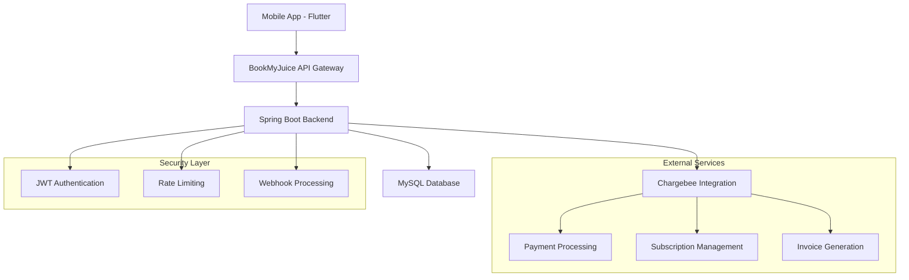

# BookMyJuice Server - Complete Backend Documentation

## 📋 Overview

BookMyJuice Server is a **Spring Boot-based backend application** that powers the BookMyJuice cold-pressed juice subscription service. It provides secure authentication, subscription management, seamless Chargebee integration, and comprehensive payment processing.

---

## 🏗️ Architecture

### System Architecture



### Technology Stack

| Component | Technology | Version |
|-----------|-----------|---------|
| **Framework** | Spring Boot | 3.1.0 |
| **Language** | Java | 17+ |
| **Database** | MySQL | 8.x |
| **Build Tool** | Maven | 3.6+ |
| **Authentication** | JWT (jjwt) | 0.11.5 |
| **Security** | Spring Security | 6.x |
| **ORM** | Spring Data JPA | 3.1.0 |
| **Payment Integration** | Chargebee | 3.30.0 |
| **Rate Limiting** | Bucket4j | Latest |
| **Logging** | SLF4J + Logback | Latest |

---

## 🎯 Core Features

### 🔐 Authentication & Authorization
- **JWT-based Authentication** with secure token management
- **Role-based Access Control** (User, Moderator, Admin)
- **Password Encryption** using BCrypt
- **Session Management** with refresh tokens
- **Rate Limiting** per IP address and global limits

### 💳 Subscription Management
- **Chargebee Integration** for complete subscription lifecycle
- **Multiple Plan Support** (Premium, Signature, Delight)
- **Subscription Status Tracking** (Active, Cancelled, Paused)
- **Billing Cycle Management**
- **Plan Change/Upgrade Functionality**

### 🛒 Product Management
- **Item Management** for juice products
- **Pricing Strategy** with multiple price points per currency
- **Inventory Tracking**
- **Product Catalog** with categorization
- **Item-ItemPrice Bidirectional Relationships**

### 📦 Order Processing
- **Order Lifecycle Management**
- **Payment Processing** via Chargebee
- **Invoice Generation** and PDF export
- **Order Tracking** with status updates
- **Email Notifications**

### 🎣 Webhook Integration
- **Real-time Event Processing** from Chargebee
- **Event Deduplication** and idempotency handling
- **Error Handling** with retry mechanisms
- **Comprehensive Event Types**: Customer, Subscription, Invoice, Item events
- **Automatic Data Sync**: Keeps local DB in sync with Chargebee

---

## 📁 Project Structure

```
bmjServer/
├── src/
│   ├── main/
│   │   ├── java/com/bookmyjuice/
│   │   │   ├── bmjServer.java                 # Main Application Entry Point
│   │   │   ├── ChargeBeeConfig.java          # Chargebee Configuration
│   │   │   ├── WebConfig.java                # Web Configuration
│   │   │   ├── controllers/                   # REST Controllers
│   │   │   │   ├── AuthController.java       # Authentication endpoints
│   │   │   │   ├── PricingPageController.java # Pricing management
│   │   │   │   ├── SelfServePageController.java # Customer portal
│   │   │   │   ├── OneTimeCheckoutController.java # One-time purchases
│   │   │   │   ├── ChargebeeSyncController.java # Data synchronization
│   │   │   │   ├── TestController.java       # Test endpoints
│   │   │   │   └── webhooks/                 # Webhook controllers
│   │   │   │       ├── CustomerWebhookController.java
│   │   │   │       ├── SubscriptionWebhookController.java
│   │   │   │       ├── InvoiceWebhookController.java
│   │   │   │       └── ItemWebhookController.java
│   │   │   ├── entities/                      # JPA Entities
│   │   │   │   ├── User.java
│   │   │   │   ├── Subscription.java
│   │   │   │   ├── Order.java
│   │   │   │   ├── Invoice.java
│   │   │   │   ├── Item.java
│   │   │   │   └── ItemPrice.java
│   │   │   ├── repositories/                  # Spring Data JPA Repositories
│   │   │   ├── services/                      # Business Logic Services
│   │   │   │   ├── UserService.java
│   │   │   │   ├── SubscriptionService.java
│   │   │   │   ├── ChargebeeSyncService.java
│   │   │   │   ├── ItemService.java
│   │   │   │   ├── ItemPriceService.java
│   │   │   │   ├── IdempotencyService.java
│   │   │   │   └── RateLimiterService.java
│   │   │   ├── security/                      # Security Configuration
│   │   │   │   ├── jwt/
│   │   │   │   ├── RateLimiterService.java
│   │   │   │   └── SecurityConfig.java
│   │   │   ├── utils/                         # Utility Classes
│   │   │   └── exceptions/                    # Custom Exceptions
│   │   ├── resources/
│   │   │   ├── application.properties         # Default config
│   │   │   ├── application-dev.properties     # Development config
│   │   │   ├── application-prod.properties    # Production config
│   │   │   └── logback-spring.xml            # Logging config
│   └── test/                                  # Unit and Integration Tests
├── pom.xml                                    # Maven Configuration
├── mvnw / mvnw.cmd                           # Maven Wrapper
├── Dockerfile                                 # Container Configuration
└── .env                                       # Environment Variables (local)
```

---

## 🔧 Core Services

### 1. Authentication Service
**Classes**: `AuthController.java`, `JwtTokenProvider.java`

**Endpoints**:
- `POST /api/auth/signin` - User login
- `POST /api/auth/signup` - User registration
- `POST /api/auth/refresh` - Refresh JWT token
- `POST /api/auth/logout` - User logout

**Features**:
- JWT token generation and validation
- BCrypt password hashing
- Token expiration and refresh
- Secure credential validation

### 2. Chargebee Sync Service
**Class**: `ChargebeeSyncService.java`

**Features**:
- Automatic sync on application startup
- Multi-threaded batch processing
- Syncs: Items, Customers, Subscriptions, Invoices, Orders
- Configurable batch sizes and thread pools
- Error handling and retry logic
- Idempotency to prevent duplicate processing

**Sync Configuration** (in `application.properties`):
```properties
chargebee.sync.enable-startup-sync=true
chargebee.sync.batch-size=50
chargebee.sync.thread-pool-size=3
chargebee.sync.sync-timeout-minutes=30
```

### 3. Item-ItemPrice Relationship Management
**Classes**: `ItemService.java`, `ItemPriceService.java`

**Implementation**:
- Bidirectional OneToMany relationship
- Automatic parent creation if missing
- Cascade operations for lifecycle management
- Nested entity processing from events

**How It Works**:
1. When Item event received with nested ItemPrice → Auto-link
2. When ItemPrice event received without parent → Auto-create minimal Item
3. Proper JPA cascade handling prevents orphans

### 4. Rate Limiting Service
**Class**: `RateLimiterService.java`

**Features**:
- Per-IP rate limiting (100 requests/minute)
- Global auth endpoint limit (1000 requests/minute)
- Token bucket algorithm (Bucket4j)
- Configurable limits via properties
- Admin reset capability

**Implementation**:
```java
public boolean isAllowed(String ipAddress) {
    return buckets.computeIfAbsent(ipAddress, this::createBucket)
        .tryConsume(1);
}
```

### 5. Idempotency Service
**Class**: `IdempotencyService.java`

**Features**:
- Prevents duplicate webhook processing
- Automatic cleanup of old records (4-hour retention)
- Request signature-based deduplication
- Graceful handling of duplicate events

---

## 🔌 API Endpoints

### Authentication

```
POST /api/auth/signin
  Request: { username, password }
  Response: { accessToken, refreshToken, user }
  
POST /api/auth/signup
  Request: { username, email, password }
  Response: { accessToken, user }
  
POST /api/auth/refresh
  Request: { refreshToken }
  Response: { accessToken }
```

### Test Endpoints

```
GET /api/test/all
  Public endpoint, returns: "Public Content."
  
GET /api/test/user
  Requires JWT token
  Returns: Current authenticated user
  
POST /api/test/generate_pricing_page_session_url
  Generates Chargebee pricing page session
  
POST /api/test/oneTimeCheckoutPageUrl
  Generates Chargebee one-time checkout URL
  
POST /api/test/cartCheckout
  Generates Chargebee cart checkout URL
  
GET /api/test/portal
  Generates customer self-serve portal URL
```

### Webhooks

```
POST /api/webhooks/customers
  Basic Auth required
  Processes customer events from Chargebee
  
POST /api/webhooks/subscriptions
  Basic Auth required
  Processes subscription events
  
POST /api/webhooks/invoices
  Basic Auth required
  Processes invoice events
  
POST /api/webhooks/items
  Basic Auth required
  Processes item/product events
```

### Data Sync

```
POST /api/chargebee/sync
  Admin only
  Manually trigger full sync with Chargebee
  
GET /api/chargebee/sync/status
  Check sync status and statistics
```

---

## 🔐 Security Features

### 1. JWT Authentication
- Token generation with 24-hour expiration
- Refresh token mechanism
- Secure token storage on client
- Validation on every protected endpoint

### 2. Rate Limiting
- Per-IP limits on authentication endpoints
- Global limits on sensitive operations
- Bucket4j token bucket algorithm
- Admin bypass capability

### 3. Webhook Security
- Basic authentication required
- IP whitelisting support
- Signature verification (optional)
- Request logging and audit trail

### 4. Database Security
- Parameterized queries prevent SQL injection
- BCrypt password hashing
- Prepared statements for all queries
- Encrypted configuration for secrets

### 5. HTTPS/SSL
- Forced HTTPS in production
- HSTS (HTTP Strict Transport Security)
- Secure cookie flags
- TLS 1.2+ enforcement

---

## 🚀 Deployment

### Prerequisites
- Java 17+
- MySQL 8.x
- Maven 3.6+
- Ubuntu VPS (for production)
- Domain name with DNS configuration

### Quick Start (Development)

```bash
# Clone repository
git clone <repo-url>
cd bmjServer

# Build
./mvnw clean package -DskipTests

# Create .env file
cp .env.example .env
# Edit .env with your credentials

# Run
java -jar target/com.bookmyjuice.bmjServer-0.0.2-SNAPSHOT.jar
```

### Production Deployment (Ubuntu VPS)

**See detailed guide**: `UBUNTU_VPS_DEPLOYMENT.md`

**Quick Summary**:

1. **System Preparation**
```bash
sudo apt update && sudo apt upgrade -y
sudo apt install -y openjdk-17-jdk mysql-server nginx
```

2. **Database Setup**
```bash
sudo mysql -u root -p
CREATE DATABASE bmj_db CHARACTER SET utf8mb4;
CREATE USER 'bmj_user'@'localhost' IDENTIFIED BY 'password';
GRANT ALL PRIVILEGES ON bmj_db.* TO 'bmj_user'@'localhost';
```

3. **Application Setup**
```bash
sudo mkdir -p /var/apps/bookmyjuice
cd /var/apps/bookmyjuice
git clone <repo> .
./mvnw clean package -DskipTests -P prod
```

4. **Environment Configuration**
```bash
sudo nano /var/apps/bookmyjuice/.env
# Add all required environment variables
```

5. **SSL Certificate (Let's Encrypt)**
```bash
sudo certbot certonly --standalone -d api.bookmyjuice.co.in
```

6. **Systemd Service**
```bash
sudo nano /etc/systemd/system/bookmyjuice.service
# Configure as documented in DEPLOYMENT_CHECKLIST.md

sudo systemctl enable bookmyjuice.service
sudo systemctl start bookmyjuice.service
```

7. **Nginx Reverse Proxy**
```bash
sudo nano /etc/nginx/sites-available/bookmyjuice
# Configure reverse proxy to localhost:8080
sudo systemctl restart nginx
```

### Environment Variables

**Required**:
```bash
DB_USERNAME=bmj
DB_PASSWORD=<strong_password>
ADMIN_USER=admin@bookmyjuice.co.in
ADMIN_PASSWORD=<strong_password>
JWT_SECRET=<long_random_string_64+_chars>
WEBHOOK_USERNAME=webhook@bookmyjuice.co.in
WEBHOOK_PASSWORD=<strong_password>
CHARGEBEE_SITE=bookmyjuice-test
CHARGEBEE_API_KEY=<your_chargebee_api_key>
```

**Optional**:
```bash
SPRING_PROFILES_ACTIVE=prod
SERVER_PORT=8080
SERVER_ADDRESS=0.0.0.0
```

---

## 🧪 Testing

### Build
```bash
./mvnw clean package
```

### Run Tests
```bash
./mvnw test
```

### Integration Tests
```bash
./mvnw verify
```

### Manual Testing
```bash
# Start application
java -jar target/com.bookmyjuice.bmjServer-0.0.2-SNAPSHOT.jar

# In another terminal, test endpoints
curl http://localhost:8080/api/test/all
curl -X POST http://localhost:8080/api/auth/signin \
  -H "Content-Type: application/json" \
  -d '{"username":"9876543210","password":"password"}'
```

---

## 📋 Key Implementation Details

### Item-ItemPrice Relationship
**Problem**: Chargebee sends nested ItemPrice data in Item events

**Solution**:
- Bidirectional JPA relationship
- Cascade operations for automatic lifecycle
- Helper methods `addItemPrice()` and `removeItemPrice()`
- Event processor handles nested entities

**Files**: `ItemEntity.java`, `ItemPriceEntity.java`, `ItemService.java`

### Webhook Event Handling
**Features**:
- Idempotency via event deduplication
- Automatic retry on failure
- Comprehensive logging
- Transaction management

**Files**: `WebhookEventProcessor.java`, Webhook controllers

### Database Synchronization
**Features**:
- Multi-threaded batch processing
- Configurable timeouts
- Error recovery
- Real-time status updates

**Files**: `ChargebeeSyncService.java`

---

## 🔍 Troubleshooting

### Issue: Lombok "log" Symbol Not Found
**Solution**:
- Update pom.xml with Lombok dependency and compiler plugin
- Version: 1.18.30+
- Ensure annotation processing is enabled in IDE

```xml
<dependency>
    <groupId>org.projectlombok</groupId>
    <artifactId>lombok</artifactId>
    <version>1.18.30</version>
    <scope>provided</scope>
</dependency>
```

### Issue: Database Connection Failed
**Solution**:
- Verify MySQL is running: `sudo service mysql status`
- Check credentials in .env file
- Ensure database exists: `mysql -u bmj -p -e "USE bmj_db;"`
- Check application logs for detailed error

### Issue: Chargebee API Errors
**Solution**:
- Verify API key is correct for the environment
- Check Chargebee site name matches configuration
- Ensure webhook events are configured in Chargebee dashboard
- Review Chargebee API logs

### Issue: Rate Limiting Blocking Legitimate Requests
**Solution**:
- Admin can reset limits: `GET /api/auth/reset/{ipAddress}`
- Adjust limits in `application.properties`
- Check attacker IPs in logs

---

## 📚 Additional Documentation

See individual files for detailed information:
- **`DEPLOYMENT_CHECKLIST.md`** - Pre-deployment assessment and checklist
- **`UBUNTU_VPS_DEPLOYMENT.md`** - Step-by-step VPS deployment guide
- **`PRODUCTION_READINESS.md`** - Production readiness validation
- **`ITEM_ITEMPRICE_RELATIONSHIP_IMPLEMENTATION.md`** - Entity relationship details

---

## 🌐 Environment Setup

### Local Development
1. Clone repository
2. Install Java 17 and MySQL 8
3. Create local database: `bmj_db`
4. Configure `application-dev.properties` with local credentials
5. Run: `./mvnw spring-boot:run -Dspring-boot.run.profiles=dev`

### Docker Development
```bash
docker-compose up -d

# Run with Docker
mvn clean package
docker build -t bookmyjuice-api .
docker run -p 8080:8080 \
  -e DB_USERNAME=bmj \
  -e DB_PASSWORD=password \
  -e CHARGEBEE_SITE=bookmyjuice-test \
  bookmyjuice-api
```

---

## 📞 Support & Resources

- **Spring Boot**: https://spring.io/projects/spring-boot
- **Spring Data JPA**: https://spring.io/projects/spring-data-jpa
- **Chargebee API**: https://apidocs.chargebee.com
- **JWT**: https://jwt.io
- **Bucket4j (Rate Limiting)**: https://bucket4j.io

---

## ✅ Pre-Launch Checklist

- [ ] All dependencies installed and built successfully
- [ ] Database created and migrations applied
- [ ] All environment variables configured
- [ ] Chargebee API key verified
- [ ] Rate limiting tested
- [ ] Webhook endpoints secured
- [ ] SSL certificate installed (production)
- [ ] Nginx reverse proxy configured (production)
- [ ] Systemd service created and enabled (production)
- [ ] All API endpoints tested with curl/Postman
- [ ] Logs configured and rotation enabled
- [ ] Database backups scheduled
- [ ] Monitoring alerts configured (optional)

---

**Version**: 1.0  
**Last Updated**: January 2026  
**Status**: Production Ready
